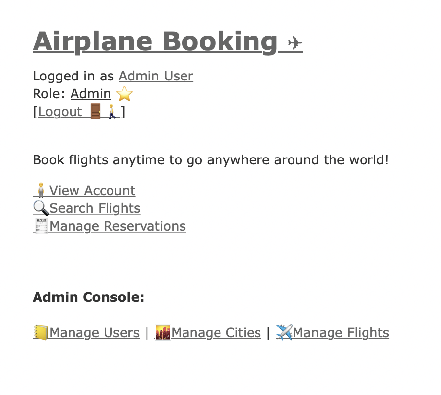

# Airplane Booking System ✈

Airplane booking system can be used to browse and book flights.
This system has been developed using Ruby on Rails as part of OODD coursework at NCSU.

[](https://github.ncsu.edu/OODD-dmmehta2/OODD-Program-2/actions/workflows/build-deploy.yml)

The User of the system can perform following tasks:
1. Search Flights
2. View/Create/Update/Delete Reservation
3. View/Create/Update/Delete Baggage
4. View/Update Account Details

The Admin of the system can do all the tasks that the user can perform and in addition to that:
1. Create/Update/Delete Flights
2. Create/Delete Users
3. Get reservations for all users

The system has been deployed on Heroku, and the hosted url is [yoururl.tech/abs](https://yoururl.tech/abs).

The **Admin credentials** to access the system are:
```
Email: admin@abs.com
Password: admin@123
```

Admin View:



The **User credentials** to access the system are:
```
Email: user1@abs.com
Password: user@123
```

User View:


The application has following functionality:
1. **Signup/Login/Logout:** Login is needed to access any url within the website. Once logged in, user can log out by clicking on
**Logout** at top of the webpage.
2. **Search flights:** Go to Search flight on main page. There it lists down all the flights in the system. 
The filter on the top allows you to search for flights from specific origin to destination city.
3. **Create Reservation:** You can create reservations by clicking on **Create Reservation** for a particular flight.
Enter number of passengers, select reservation class and amenities and click Create Reservation. The cost will be 
calculated automatically with the formula, `number of passengers * flight cost`.
4. **Manage Reservations:** You can manage all reservations by going to Manage Reservations on Home Page. You can edit/delete as required.
5. **Manage Baggage:** You can add/edit/delete baggage as per the requirement.
The baggage cost is calculated as `baggage_weight * 5` and is added to the total of reservation cost.
6. **View/Update Account:** You can view or update user account details by going to **View Account** on the main page.

**[Admin Only]**

1. **Add/Edit/Delete Flight:** Admin can add, edit or delete a flight by going to **Manage Flights** under Admin Console.
2. **Add/Edit/Delete User:** Admin can add, edit or delete users by going to **Manage Users** under Admin Console.
3. **Add/Edit/Delete Cities:** Admin can add, edit or delete cities by going to **Manage Cities** under Admin Console.

For now the following considerations (edge cases) are implemented into the system:
1. The admin user cannot be edited or deleted.
2. If a flight is deleted and it has reservations then all the reservations are deleted as well.
3. If a reservation is deleted and it has bags then all the bags are deleted as well.
4. If a city is deleted then all flights having that city are deleted.
5. If a user is deleted then all reservations of that user are deleted.
6. A Flight capacity can't be reduced below total number of existing reservations.

For any feedback please create GitHub Issues, so the developers can track them.

Enjoy ❤️
